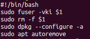

	<h1>
		Alguna vez te paso esto?
	</h1>
	: NO SE PUDO BLOQUEAR /VAR/LIB/DPKG/LOCK – OPEN (11: RECURSO NO DISPONIBLE TEMPORALMENTE)
	: NO SE PUDO BLOQUEAR EL DIRECTORIO DE ADMINISTRACIÓN (/VAR/LIB/DPKG/), ¿QUIZÁS HAYA ALGÚN OTRO PROCESO UTILIZÁNDOLO?
	
	<h2>
		En este post te tengo la solucion
	</h2>
	

